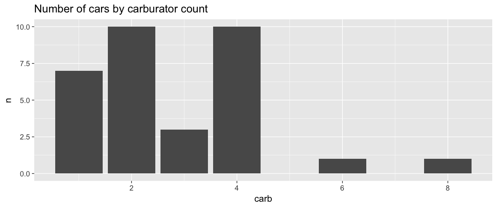

ggRough
================

<!-- README.md is generated from README.Rmd. Please edit that file -->


## Read this first

> {ggrough} is in a dormant state. Please be aware that this project doesn't work with recent releases of {ggplot2} (although the needed changes might not be big and [some people have tried to fix them](https://stackoverflow.com/questions/tagged/ggrough)). If you came here, there are other more recent projects that you might find interesting (e.g. [{roughnet}](https://github.com/schochastics/roughnet), [{roughsf}](https://github.com/schochastics/roughsf), [r-sketchy](https://github.com/sieste/r-sketchy) and [maybe more](https://github.com/search?q=rough+language%3Ar&type=repositories)). I set the repo in 'read-only' mode for now (feel free to fork). Hopefully, there will be a time in the future when I can dedicate more time to work on it: there have been many improvements to {patchwork} that would solve some of the existing shortcomings. I still believe that a nice way to create sketchy visualisations would be a neat addition to the ggplot2 ecosystem, and they have been a great help in my teaching practice.

## What is `ggrough`?

`ggrough` is an R package that converts your
[`ggplot2`](http://ggplot2.tidyverse.org) plots to rough/sketchy charts,
using the excellent javascript [`roughjs`](http://roughjs.com) library.

``` r
library(ggplot2)
count(mtcars, carb) %>%
  ggplot(aes(carb, n)) +
  geom_col() + 
  labs(title="Number of cars by carburator count") + 
  theme_grey(base_size = 16) -> p 
p
```

<!-- -->

``` r
library(ggrough)
options <- list(
  Background=list(roughness=8),
  GeomCol=list(fill_style="zigzag", angle_noise=0.5, fill_weight=2))
get_rough_chart(p, options)
```


## How to install

``` r
install.packages("devtools") # if you have not installed "devtools" package
devtools::install_github("xvrdm/ggrough")
```

## How to use

Call `get_rough_chart()`, using your ggplot2 chart as the first
argument. [See this page for more ggrough examples and all the available
options to customize your
output](https://xvrdm.github.io/ggrough/articles/Customize%20chart.html).

## Word of caution

`ggrough` is a **work in progress** and **still has big bugs**.
Contributions are welcome\!

`ggrough` works “ok” with RStudio Viewer. However you need to redraw
your chart everytime you change the size of the Viewer tab and the
charts will redraw when you try to copy it via `Export -> Save As
Image`. The latter can be annoying since some `roughjs` settings can add
a lot of randomness.

`ggrough` doesn’t work well with Rmarkdown files yet. For example, it
can only generate one chart per document. If you have multiple charts it
overlays them on top of each other.

## Under the hood

`ggrough` is an [htmlwidget](http://htmlwidgets.org). It converts your
[`ggplot2`](http://ggplot2.tidyverse.org) chart to SVG using the package
[`svglite`](http://r-lib.github.io/svglite/) then parse the different
elements (`<rect>`, `<path>`, `<circle>`…) to create a chart in a [HTML
Canvas](https://developer.mozilla.org/en-US/docs/Web/API/Canvas_API/Tutorial)
element\[1\] with [`roughjs`](http://roughjs.com).

An article explaining how `ggrough` works is in the making, to help
potential contributors get started.

## Thanks

This package is only possible thanks to the massive work of:

  - [Kent Russell —
    twitter:timelyportfolio](https://twitter.com/timelyportfolio) and
    [Bob Rudis — twitter:hrbrmstr](https://twitter.com/hrbrmstr) for the
    enormous educational content they created or shared about
    `htmlwidget` and `ggplot2`.
  - [Preet Shihn — twitter:preetster](https://twitter.com/preetster) and
    all the contributors of [`roughjs`](http://roughjs.com).
  - [Hadley Wickham —
    twitter:hadleywickham](https://twitter.com/hadleywickham) and all
    the contributors of [`ggplot2`](http://ggplot2.tidyverse.org).
  - [Lionel Henry —
    twitter:\_lionelhenry](https://twitter.com/_lionelhenry) and all the
    contributors of [`svglite`](http://r-lib.github.io/svglite/)

<!-- end list -->

1.  `roughjs` can also render to SVG. This will be supported by
    `ggrough` in the future
